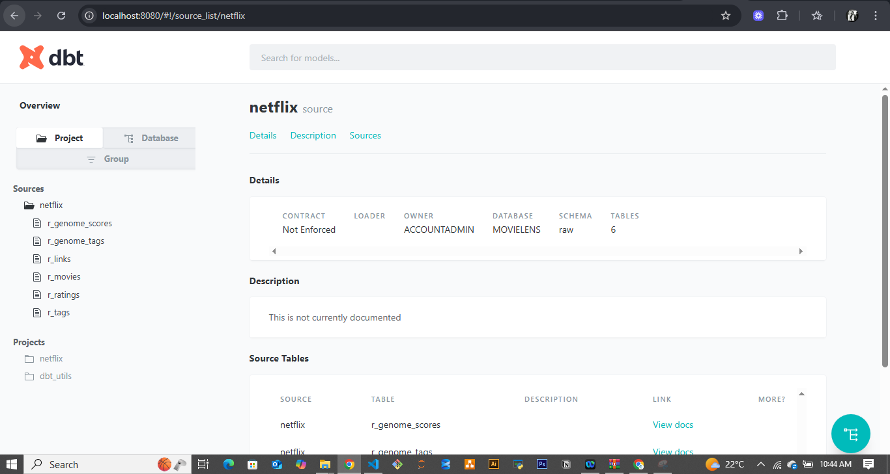

# 🎬 Netflix Data Analysis End-to-End Project (AWS S3 → Snowflake → dbt)


---

## 📚 Table of Contents
- [📖 Overview](#-project-overview)
- [🧱 Architecture](#-architecture-diagram)
- [🪣 Step 1: Data Ingestion](#-step-1-data-ingestion--aws-s3--snowflake)
- [🧩 Step 2: Initialize dbt Project](#-step-2-initialize-dbt-project)
- [🧙‍♂️ Step 3: Staging and Transformations](#-step-3-staging-and-transformations)
- [🧮 Step 4: Building Fact & Dimension Models](#-step-4-building-fact--dimension-models)
- [⚙️ Step 5: Incremental Loads & Ephemeral Models](#️-step-5-incremental-loads--ephemeral-models)
- [🕒 Step 6: Slowly Changing Dimensions (SCD)](#-step-6-slowly-changing-dimensions-scd)
- [🧠 Step 7: Macros, Seeds & Sources](#-step-7-macros-seeds--sources)
- [✅ Step 8: Testing & Documentation](#-step-8-testing--documentation)
- [📊 Step 9: Analysis & Gold Layer](#-step-9-analysis--gold-layer)
- [🚀 How to Run This Project](#-how-to-run-this-project)
- [🧭 Project Highlights](#-project-highlights)
- [🧰 Tools & Technologies](#-tools--technologies)
- [🧑‍💻 Author & Contact](#-author--contact)
- [🏁 Conclusion](#-conclusion)

---

## 📖 Project Overview

This project demonstrates a **complete data engineering and analytics pipeline** using **AWS S3**, **Snowflake**, and **dbt (Data Build Tool)** — from **raw CSV ingestion** to **gold-level analytics and visualization-ready models**.

It replicates a **real-world Netflix data workflow**, showcasing how to move, transform, test, and document data efficiently using modern data stack principles.

**Medium Article:**  
[Building an End-to-End Data Pipeline with dbt, Snowflake & AWS — The Netflix Data Analysis Project](https://medium.com/@codegnerdev/building-an-end-to-end-data-pipeline-with-dbt-snowflake-aws-the-netflix-data-analysis-project-bc26c1825e52)

---

## 🧱 Architecture Diagram


---

## 🪣 Step 1: Data Ingestion — AWS S3 → Snowflake

The raw Netflix data (CSV files) is stored in **AWS S3**.  
A **Snowflake stage** is created to connect and load this data using the `COPY INTO` command.

```sql
COPY INTO raw.netflix_data
FROM @aws_stage/netflix_data/
FILE_FORMAT = (TYPE = CSV FIELD_OPTIONALLY_ENCLOSED_BY='"' SKIP_HEADER = 1);
````

### ✅ Steps:

* Create **Snowflake user** and **warehouse**
* Define **stages** to pull data from AWS
* Load data using **Snowflake COPY command**


---

## 🧩 Step 2: Initialize dbt Project


We initialize a new dbt project for Netflix using:

```bash
dbt init netflix_project
```

Then configure connections to **Snowflake** via the `profiles.yml`.

### Key Folders:

* `models/` → Transformations
* `seeds/` → Static data
* `snapshots/` → Change tracking
* `macros/` → Reusable SQL logic

---

## 🧙‍♂️ Step 3: Staging and Transformations

All raw data is **staged** into clean, standardized tables using dbt models.

```bash
dbt run
```

This creates **views** in Snowflake (logical transformations).
Views don’t store data — they simply reference SQL queries dynamically.


---

## 🧮 Step 4: Building Fact & Dimension Models

We move from staging to **data modeling**.
Instead of using the raw schema, we now use the **DEV schema**.

### Models:

* **Dimension Tables:** e.g., `dim_users`, `dim_movies`
* **Fact Table:** `fct_ratings` (stores incremental logic)


---

## ⚙️ Step 5: Incremental Loads & Ephemeral Models

For large datasets, we use **incremental materialization** in dbt.
This ensures only new or updated records are processed.

```sql
{{ config(materialized='incremental', unique_key='rating_id') }}
```

Ephemeral models are used for temporary computations that run in memory.


---

## 🕒 Step 6: Slowly Changing Dimensions (SCD)

We implement **SCD1**, **SCD2**, and **SCD3/6** to handle data changes over time.

Example surrogate key:

```sql
{{ dbt_utils.generate_surrogate_key(['user_id','movie_id','tag']) }} AS row_key
```


---

## 🧠 Step 7: Macros, Seeds & Sources

### 🪄 Macros

Reusable SQL snippets that simplify testing and transformation logic.


### 🌱 Seeds

Static reference datasets are loaded using:

```bash
dbt seed
```

### 📄 Sources

Defined in `sources.yml` to track data lineage.

---

## ✅ Step 8: Testing & Documentation

We use both **schema** and **singular** tests to validate data integrity.

```bash
dbt test
```


For documentation:

```bash
dbt docs generate
dbt docs serve
```




---

## 📊 Step 9: Analysis & Gold Layer

The **Gold Layer** delivers business-ready analytics and insights.


### Analyses Include:

* 🎞️ Movies with ≥100 Ratings
* 🎭 Genre Rating Distribution
* 👥 User Engagement
* 📈 Movie Release Trends
* 🏷️ Tag Relevance
* 🏆 Top 10 Movies by Genre
* 📅 Monthly Rating Trends

**Files in `models/gold/`:**

```
movie_analysis.sql
genre_ratings.sql
user_engagement.sql
release_trends.sql
tag_relevance.sql
top10_by_genre.sql
monthly_trends.sql
```


---

## 🚀 How to Run This Project

Follow these steps to replicate this project locally or in your own environment.

### 1️⃣ Clone the Repository

```bash
git clone https://github.com/KibutuJr/Netflix-dbt-project.git
cd Netflix-dbt-project
```

### 2️⃣ Set Up Virtual Environment (Optional but Recommended)

```bash
python -m venv venv
source venv/bin/activate      # (Mac/Linux)
venv\Scripts\activate         # (Windows)
```

### 3️⃣ Install dbt and Dependencies

```bash
pip install dbt-snowflake dbt-core
```

### 4️⃣ Configure dbt Profile

Update your `profiles.yml` file with your **Snowflake credentials**:

```yaml
netflix_project:
  target: dev
  outputs:
    dev:
      type: snowflake
      account: <your_account>
      user: <your_username>
      password: <your_password>
      role: <your_role>
      database: MOVIELENS
      warehouse: COMPUTE_WH
      schema: DEV
```

### 5️⃣ Run dbt Commands

```bash
dbt debug             # Test connection
dbt seed              # Load seed files
dbt run               # Execute models
dbt test              # Validate data
dbt docs generate     # Generate documentation
dbt docs serve        # Open docs locally
```

### 6️⃣ Verify in Snowflake

Check the **DEV schema** to view your staged, transformed, and gold-layer tables.

---

## 🧭 Project Highlights

* **End-to-End Data Flow:** AWS S3 → Snowflake → dbt
* **Modern Data Stack:** Modular, scalable, cloud-native
* **Incremental Models:** Optimized performance
* **Snapshots & SCDs:** Full data versioning
* **Automated Testing & Docs:** dbt-native QA
* **Ad-hoc Analysis:** Gold-layer insights

---

## 🧰 Tools & Technologies

| Tool          | Purpose                        |
| ------------- | ------------------------------ |
| **AWS S3**    | Raw data storage               |
| **Snowflake** | Cloud data warehouse           |
| **dbt**       | Data modeling & transformation |
| **SQL**       | Querying & transformations     |
| **Python**    | Data prep and automation       |

---

## 🧑‍💻 Author & Contact

👤 **Fred Kibutu**
🌐 [Portfolio](https://kibutujr.vercel.app/)
💼 [LinkedIn](https://www.linkedin.com/in/fred-kibutu/)
📧 [Email](mailto:kibutujr@gmail.com)

---

## 🏁 Conclusion

This project showcases a **real-world dbt-driven Netflix data pipeline**, transforming raw datasets into actionable insights.
It reflects how modern data teams use **dbt, Snowflake, and AWS** to power analytics at scale — from **data ingestion** to **business-ready metrics**.

---

✨ *"Data isn’t just numbers — it’s the story behind every play, pause, and rating."* 🎥
